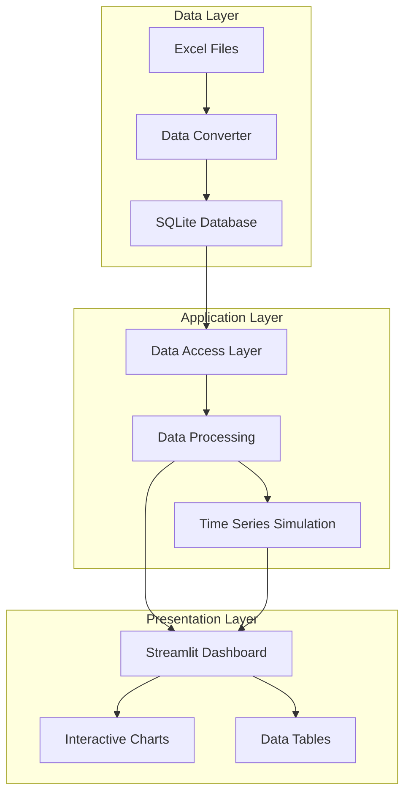
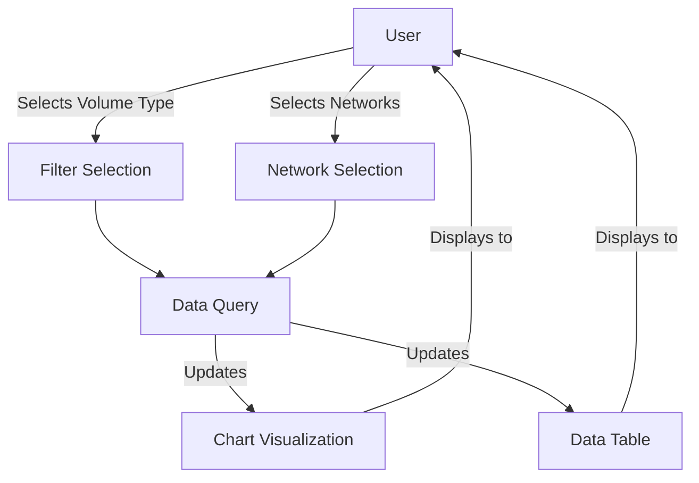

# System Patterns: Excel to SQLite Production Dashboard

## Architecture Overview

The system follows a three-tier architecture with clear separation of concerns:



## Key Design Patterns

### Data Processing Patterns

1. **ETL Pipeline**
   - **Extract**: Read data from Excel files using pandas
   - **Transform**: Clean and structure the data
   - **Load**: Insert into SQLite database

2. **Repository Pattern**
   - Encapsulates database access logic
   - Uses SQL queries to retrieve aggregated data
   - Provides clean interface for the application layer

3. **Caching Strategy**
   - Uses Streamlit's `@st.cache_data` decorator
   - Prevents redundant database queries
   - Improves dashboard responsiveness

### Visualization Patterns

1. **Component-Based UI**
   - Dashboard divided into logical sections
   - Each visualization is a self-contained component
   - Consistent layout and styling across components

2. **Interactive Filter Pattern**
   - User selections drive data filtering
   - Immediate visual feedback on selection changes
   - Maintains state across different visualizations

3. **Multi-View Coordination**
   - Related visualizations update together
   - Consistent data representation across views
   - Synchronized filtering across components

### Data Simulation Pattern

1. **Time Series Generation**
   - Base values derived from actual production data
   - Random variations applied for realistic simulation
   - Seasonal patterns incorporated for trend analysis

## Component Relationships

### Data Flow


### User Interaction Flow



## Technical Decisions

1. **SQLite for Storage**
   - Lightweight, serverless database
   - SQL query capabilities without database server
   - Single file storage for portability
   - ACID compliance for data integrity

2. **Pandas for Data Processing**
   - Efficient handling of tabular data
   - Built-in Excel file support
   - Powerful data transformation capabilities
   - Direct SQLite integration

3. **Streamlit for Dashboard**
   - Python-native web application framework
   - Reactive programming model
   - Built-in caching mechanisms
   - Simple deployment options

4. **Plotly for Visualization**
   - Interactive charts with hover details
   - Support for multiple chart types
   - Consistent styling and theming
   - Client-side interactivity

## Code Organization

```
project/
├── app.py                 # Main Streamlit dashboard
├── insert.py              # Excel to SQLite converter
├── test_insertion.py      # Validation script
├── data/                  # Excel data files
│   ├── wellprod *.XLSX    # Well production data
│   └── mpvl *.XLSX        # MPVL data
└── *.db                   # SQLite database files
```

## Future Architecture Considerations

1. **Modularization**
   - Separate data processing from visualization
   - Create reusable components for different data types
   - Implement proper package structure

2. **Automated Testing**
   - Unit tests for data processing functions
   - Integration tests for database operations
   - Visual regression tests for dashboard components

3. **Deployment Strategy**
   - Containerization for consistent environments
   - CI/CD pipeline for automated deployment
   - Monitoring and logging infrastructure
