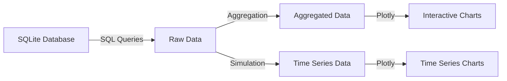

# Technical Context: Excel to SQLite Production Dashboard

## Technology Stack

### Core Technologies

| Technology | Version | Purpose |
|------------|---------|---------|
| Python     | 3.8+    | Primary programming language |
| SQLite     | 3.x     | Database engine for storage |
| Streamlit  | 1.x     | Web application framework |
| Pandas     | 1.x     | Data manipulation and analysis |
| Plotly     | 5.x     | Interactive data visualization |

### Key Libraries

| Library    | Purpose |
|------------|---------|
| openpyxl   | Excel file handling for pandas |
| numpy      | Numerical operations for data processing |
| sqlite3    | Python's built-in SQLite interface |
| datetime   | Date and time manipulation |
| math       | Mathematical functions for simulations |

## Development Environment

### Requirements

- Python 3.8 or higher
- pip package manager
- Virtual environment (recommended)
- Git for version control

### Setup Instructions

1. Clone the repository
2. Create a virtual environment: `python -m venv venv`
3. Activate the virtual environment:
   - Windows: `venv\Scripts\activate`
   - macOS/Linux: `source venv/bin/activate`
4. Install dependencies: `pip install -r requirements.txt`
5. Place Excel files in the `data/` directory
6. Run data import: `python insert.py`
7. Launch dashboard: `streamlit run app.py`

## Data Flow Architecture

### Excel to SQLite Conversion

### Dashboard Data Pipeline

## Technical Constraints

### Performance Considerations

- **Data Volume**: Excel files can be large (10,000+ rows)
- **Query Optimization**: Complex aggregations need efficient SQL
- **Caching**: Streamlit caching prevents redundant database queries
- **Browser Rendering**: Interactive charts must render efficiently
- **Memory Usage**: Large datasets must be managed carefully

### Security Considerations

- **Data Integrity**: Ensure accurate conversion from Excel to SQLite
- **Input Validation**: Handle malformed Excel files gracefully
- **Error Handling**: Provide clear error messages for data issues
- **Local Deployment**: System designed for internal network use

### Compatibility Requirements

- **Browser Support**: Modern web browsers (Chrome, Firefox, Safari, Edge)
- **Screen Sizes**: Support for desktop and tablet displays
- **Excel Formats**: Support for .xlsx format (Excel 2007+)
- **Operating Systems**: Cross-platform support (Windows, macOS, Linux)

## Dependencies

### External Dependencies

- **Excel Data Source**: Relies on standardized Excel format
- **Python Environment**: Requires Python runtime
- **Web Browser**: Requires modern browser for dashboard

### Internal Dependencies

- **Database Schema**: Visualization depends on specific table structure
- **Data Quality**: Visualizations assume clean, consistent data
- **File Naming**: Import process expects specific file naming patterns

## Technical Debt

### Current Limitations

1. **Hardcoded Paths**: File paths are currently hardcoded
2. **Limited Error Handling**: Minimal validation of Excel data
3. **Single Database**: No support for multiple database connections
4. **Simulated Time Series**: Historical data is simulated, not actual
5. **Manual Import Process**: Excel import requires manual execution

### Future Technical Improvements

1. **Configuration File**: Externalize paths and settings
2. **Data Validation Layer**: Add robust Excel validation
3. **Multi-Database Support**: Allow connecting to multiple data sources
4. **Historical Data Storage**: Store actual historical data
5. **Automated Import**: Schedule regular data imports
6. **Unit Testing**: Add comprehensive test coverage
7. **Code Modularization**: Refactor into proper package structure

## Deployment Model

### Current Deployment

- **Local Execution**: Run on developer/analyst machine
- **Manual Updates**: Manual process to update data and restart
- **Single User**: Designed for individual use

### Future Deployment Options

- **Docker Container**: Containerized deployment for consistency
- **Internal Web Server**: Host on internal network for team access
- **Scheduled Updates**: Automated data refresh process
- **Multi-User Support**: Concurrent access by multiple users
